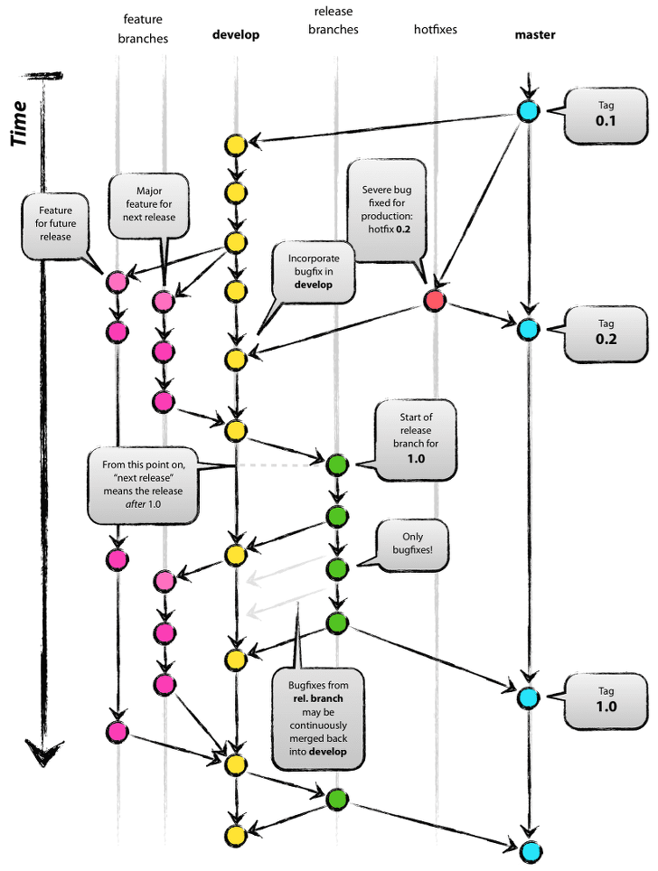

+ Git Flow란 저장소를 보다 고수준으로 관리하기 위한 브랜칭 기법이다.
+ 프로젝트의 규모가 점점 커지면, 많은 인원들이 코드에 동시에 접근하면서 필연적으로 문제가 발생하게 된다.
따라서 현재 내 브랜치가 어떤 문맥에서 생겨나게 됐는지 파악하기 위해 Git Flow에 대한 이해는 반드시 필요하다.

+ Git Flow는 기본적으로 브랜치를  feature - develop - release - hotfix - master 5단계로 나누어 코드를 관리한다. 각 브랜치들의 목적은 다음과 같다.

1) Master 브랜치
+ (메인 배포판) 실제로 클라이언트에서 이용하는 최종 형태의 메인 브랜치이다.

2) Develop 브랜치
+ (메인 개발) 현재 개발이 진행 중인 메인 브랜치이다. Master 브랜치와 마찬가지로 추가적으로 생성 또는 삭제되지 않는 브랜치이다.

3) Feature 브랜치
+ (추가 기능 개발) 새로운 기능을 추가하기 위해 사용되는 브랜치로, 특정 기능의 개발이 필요할 때 Develop 브랜치에서 파생되며, 
기능 개발이 완료되면 Develop 브랜치로 병합된다. 가장 많이 생성되었다 삭제되는 브랜치이다.

4) Release 브랜치
+ (배포 준비, 오류 확인) 실제로 프로젝트를 배포하기 위한 브랜치이다.
이 브랜치는 지금까지 개발한 기능들이 있는 Develop 브랜치에서 파생되어, 각종 오류 사항이나 문제들을 검토 및 수정하는 일종의 테스트 서버로 볼 수 있다.
수정이 완료되면 Release 브랜치는 Develop 브랜치와 Master 브랜치로 병합된다.

5) Hotfix 브랜치
+ (긴급 오류 수정) Hotfix 브랜치는 배포된 Master 브랜치에서 예기치 못한 버그가 발생했을 때 급하게 Develop, Feature 브랜치를 거치지 않고 버그를 수정하는 단계이다.
+ 수정이 완료되면 Develop과 Master 브랜치로 병합된다.

