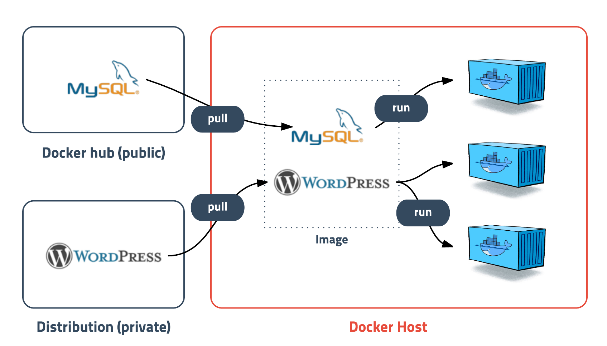

# 도커
## 1. 도커란 무엇인가?
- 컨테이너 기반의 오픈소스 가상화 플랫폼.
- 다양한 프로그램, 실행환경을 컨테이너로 추상화하고 동일한 인터페이스를 제공하여 프로그램의 배포 및 관리를 단순하게 해준다.
- 백엔드 프로그램, 데이터베이스 서버, 메시지 큐등 어떤 프로그램도 컨테이너로 추상화할 수 있다.

## 2. 컨테이너
- 가상화 기술의 하나.
- 격리된 공간에서 프로세스가 동작하는 기술.

### 1) 기존의 가상화
- 기존의 가상화 방식은 주로 OS를 가상화.
- 전가상화와 반가상화 방식이 있음.
- 추가적인 OS를 설치하여 가상화하는 방법으로는 Overhead가 발생, 성능문제가 발생.
### 2) Docker의 가상화
- 프로세스를 격리하는 방식.
- CPU나 메모리는 딱 프로세스가 필요한 만큼만 추가로 사용하고 성능적으로도 거의 손실이 없음.

## 3. 이미지

- 컨테이너 실행에 필요한 파일과 설정값등을 포함하고 있는 것.
- 상태값을 가지지 않고 변하지 않음(Immutable).
- 컨테이너는 이미지를 실행한 상태라고 볼 수 있고 추가되거나 변하는 값은 컨테이너에 저장된다.
- 같은 이미지에서 여러개의 컨테이너를 생성할 수 있고 컨테이너의 상태가 바뀌거나 컨테이너가 삭제되더라도 이미지는 변하지 않고 그대로 남아있는다.
- 이미지는 컨테이너를 실행하기 위한 모든 정보를 가지고 있기 때문에 더 이상 의존성 파일을 컴파일하고 이것저것 설치할 필요가 없다.

## 4. 레이어 저장방식
- 도커 이미지는 컨테이너를 실행하기 위한 모든 정보를 가지고 있기 때문에 보통 용량이 수백메가MB에 이른다.
- 처음 이미지를 다운받을 땐 크게 부담이 안되지만, 기존 이미지에 파일 하나 추가했다고 수백메가를 다시 다운받는다면 매우 비효율적일 수 밖에 없습니다.
- 도커는 이런 문제를 해결하기 위해 레이어layer라는 개념을 사용하고 유니온 파일 시스템을 이용하여 여러개의 레이어를 하나의 파일시스템으로 사용할 수 있게 해줍니다.
- 이미지는 여러개의 읽기 전용read only 레이어로 구성되고 파일이 추가되거나 수정되면 새로운 레이어가 생성됩니다.

  1. ubuntu 이미지가 A + B + C의 집합이라면, ubuntu 이미지를 베이스로 만든 nginx 이미지는 A + B + C + nginx가 됩니다.
  2. webapp 이미지를 nginx 이미지 기반으로 만들었다면 예상대로 A + B + C + nginx + source 레이어로 구성됩니다.
  3. webapp 소스를 수정하면 A, B, C, nginx 레이어를 제외한 새로운 source(v2) 레이어만 다운받으면 되기 때문에 굉장히 효율적으로 이미지를 관리할 수 있습니다.

- 컨테이너를 생성할 때
  - 기존의 이미지 레이어 위에 읽기/쓰기read-write 레이어를 추가합니다.
  - 이미지 레이어를 그대로 사용하면서 컨테이너가 실행중에 생성하는 파일이나 변경된 내용은 읽기/쓰기 레이어에 저장되므로 여러개의 컨테이너를 생성해도 최소한의 용량만 사용합니다.
