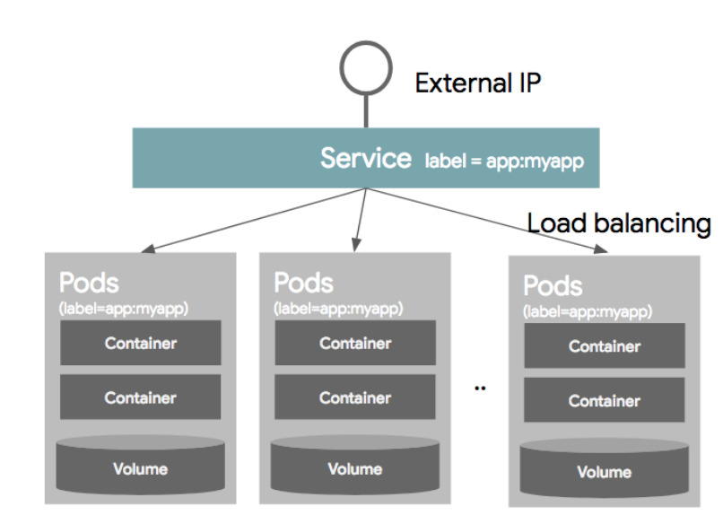

# 쿠버네틱스(kubernetes)
## 1. 쿠버네틱스란?
- 컨테이너화된 애플리케이션을 자동으로 배포, 스케일링 및 관리해주는 오픈소스 플랫폼
- 이 플랫폼에서는 컨테이너화된 애플리케이션을 배포하고 확장하는 데 수동 프로세스가 필요하지 않음.

## 2. 쿠버네틱스의 필요성
- 도커가 컨테이너를 사용하기 편하게 만들면서 어플리케이션 개발 과정 전반적으로 큰 혁신을 가져왔습니다.
- 하지만 실제 상용 서비스를 하다보면 여러 서버를 운영해야하는데, 매번 배포때마다 여러대 서버에 컨테이너를 배포하는 전체 과정을 수동으로 제어해야 합니다.
- 이러한 불편함을 해결하기 위해 컨테이너 오케스트레이션 시스템들이 나타났습니다.
  - 컨테이너 오케스트레이션 시스템을 사용하면 상용 서비스에 사용할 서버들을 클러스터로 구성하기만 하면 명령어 한번으로 자동 배포할 수 있습니다.
  - 또 클러스터 일부에 장애가 발생하면 시스템이 알아서 장애가 발생한 서버에 있는 컨테이너를 정상 운영 중인 다른 서버로 옮겨서 실행하며 트래픽도 자동으로 중지시키고 새로 옮겨서 실행시킵니다.

## 3. 쿠버네틱스의 특징
1. 선언적 API
  - 쿠버네티스가 어떤 상태가 되야 할지만 설정하면 지속해서 컨테이너의 상태를 확인하여 설정한 상태에 맞춥니다.
2. 워크로드 분리
  - 쿠버네티스는 분산된 프로세스의 관리를 추상화하는 레이어가 있어 시스템 운영에서 많은 고민을 덜어줍니다.
3. 어디서나 실행 가능

## 4. 쿠버네틱스의 이해
### 1) 마스터와 노드

- 클러스터 전체를 관리하는 컨트롤러로써 마스터가 존재하고, 컨테이너가 배포되는 머신 (가상머신이나 물리적인 서버머신)인 노드가 존재한다. 
### 2) 오브젝트
- 가장 기본적인 구성단위가 되는 기본 오브젝트(Basic object)와, 이 기본 오브젝트(Basic object) 를 생성하고 관리하는 추가적인 기능을 가진 컨트롤러(Controller) 로 이루어진다.
- 그리고 이러한 오브젝트의 스펙(설정)이외에 추가정보인 메타 정보들로 구성이 된다. 
#### 2-1) 오브젝트 스펙 (Object Spec)
- 오브젝트들은 모두 오브젝트의 특성 (설정정보)을 기술한 오브젝트 스펙 (Object Spec)으로 정의가 된다.
- 커맨드 라인을 통해서 오브젝트 생성시 인자로 전달하여 정의를 하거나 또는 yaml이나 json 파일로 스펙을 정의할 수 있다.
#### 2-2) 기본 오브젝트 (Basic Object)
- 컨테이너화되어 배포되는 애플리케이션의 워크로드를 기술하는 오브젝트로 Pod,Service,Volume,Namespace 4가지가 있다.
1. Pod
- 쿠버네티스에서 가장 기본적인 배포 단위로, 컨테이너를 포함하는 단위
- 쿠버네티스의 특징중의 하나는 컨테이너를 개별적으로 하나씩 배포하는 것이 아니라 Pod 라는 단위로 배포.
- Pod는 하나 이상의 컨테이너를 포함
2. Volumn
- 볼륨은 컨테이너의 외장 디스크로 생각하면 된다.
- Pod가 기동할때 디폴트로, 컨테이너마다 로컬 디스크를 생성해서 기동되는데, 이 로컬 디스크의 경우에는 영구적이지 못하다. 즉 컨테이너가 리스타트 되거나 새로 배포될때 마다 로컬 디스크는 Pod 설정에 따라서 새롭게 정의되서 배포되기 때문에, 디스크에 기록된 내용이 유실된다.
- 데이타 베이스와 같이 영구적으로 파일을 저장해야 하는 경우에는 컨테이너 리스타트에 상관 없이 파일을 영속적으로 저장해야 하는데, 이러한 형태의 스토리지를 볼륨이라고 한다.
- Pod가 기동할때 컨테이너에 마운트해서 사용한다.
- 쿠버네티스의 볼륨은 Pod내의 컨테이너간의 공유가 가능하다.

3. Service
- 일반적인 분산환경에서는 하나의 Pod로 서비스 하는 경우는 드물고 여러개의 Pod를 로드밸런서를 이용해서 하나의 IP와 포트로 묶어서 서비스를 제공한다.
- Pod의 경우에는 동적으로 생성이 되고, 장애가 생기면 자동으로 리스타트 되면서 그 IP가 바뀌기 때문에, 로드밸런서에서 Pod의 목록을 지정할 때는 IP주소를 이용하는 것은 어렵다.
- 또한 오토 스케일링으로 인하여 Pod 가 동적으로 추가 또는 삭제되기 때문에, 이렇게 추가/삭제된 Pod 목록을 로드밸런서가 유연하게 선택해 줘야 한다.
  - 그래서 사용하는 것이 라벨(label)과 라벨 셀렉터(label selector) 라는 개념이다.
  1. 라벨 셀렉터
  - 서비스를 정의할때, 어떤 Pod를 서비스로 묶을 것인지를 정의하는데, 이를 라벨 셀렉터라고 한다.
  - 각 Pod를 생성할때 메타데이타 정보 부분에 라벨을 정의할 수 있다.
  2. 라벨
  - 라벨은 쿠버네티스의 리소스를 선택하는데 사용이 된다.
  - 라벨을 선택하여 특정 리소스만 배포하거나 업데이트할 수 있고 또는 라벨로 선택된 리소스만 Service에 연결하거나 특정 라벨로 선택된 리소스에만 네트워크 접근 권한을 부여하는 등의 행위를 할 수 있다.
- 서비스는 라벨 셀렉터에서 특정 라벨을 가지고 있는 Pod만 선택하여 서비스에 묶게 된다.

4. NameSpace
- 네임스페이스는 한 쿠버네티스 클러스터내의 논리적인 분리단위라고 보면 된다.
- Pod,Service 등은 네임 스페이스 별로 생성이나 관리가 될 수 있고, 사용자의 권한 역시 이 네임 스페이스 별로 나눠서 부여할 수 있다.
  - 즉 하나의 클러스터 내에, 개발/운영/테스트 환경이 있을때, 클러스터를 개발/운영/테스트 3개의 네임 스페이스로 나눠서 운영할 수 있다.
- 사용자별로 네임스페이스별 접근 권한을 다르게 운영할 수 있다.
- 네임스페이스별로 리소스의 쿼타 (할당량)을 지정할 수 있고, 네임 스페이스별로 리소스를 나눠서 관리할 수 있다. (Pod, Service 등)

- 네임 스페이스는 논리적인 분리 단위이지 물리적이나 기타 장치를 통해서 환경을 분리(Isolation)한것이 아니다.
  - 다른 네임 스페이스간의 pod 라도 통신은 가능하다. 

## 5. 쿠버네틱스 & Docker

1. 쿠버네티스가 노드에 대해 포드를 예약하면 해당 노드의 kubelet이 지정된 컨테이너를 실행하도록 Docker에 명령한다.
2. 이후 kubelet은 Docker로부터 이러한 컨테이너의 상태를 계속해서 수집하고 마스터에서 해당 정보를 집계합니다.
3. Docker는 해당 노드에 컨테이너를 풀링하고 이러한 노드를 평소와 같이 시작하고 중지합니다.

- 차이가 있다면 관리자가 모든 컨테이너의 모든 노드에서 작업을 직접 수행하는 것이 아니라 자동화된 시스템이 이러한 작업을 Docker에 요청한다는 것입니다.
