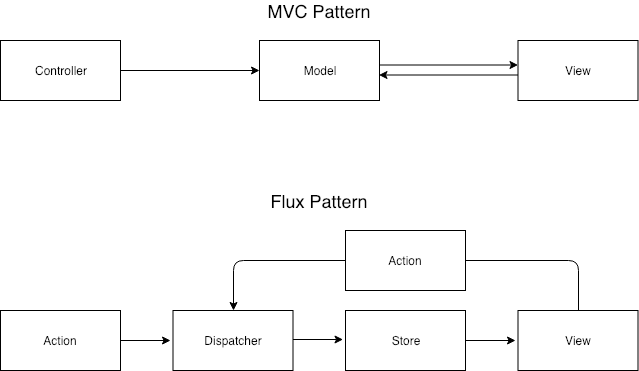

1. React란?
+ React는 페이스북에서 제공하는 자바스크립트 UI 라이브러리
+ UI 컴포넌트를 만드는 일만 하며 캡슐화를 잘 시켜줘서 재사용 성이 높습니다.
+ 한가지 일만하여 단순하고 여러 자바스크립트 프레임워크나 라이브러리와 함께 사용할 수 있습니다.
+ 그래서 React를 사용하기 위해서 기존 코드를 모두 바꿀 필요 없이 필요한 부분부터 조금씩 사용이 가능합니다.

2. 왜 React를 사용하는가?
+ 웹페이지를 만들기 위해서 굳이 프론트엔드 라이브러리를 사용해야 할 필요는 없다. HTML과 CSS, 그리고 순수 자바스크립트 만으로도 웹페이지를 얼마든지 제작할 수 있다.
특히 단순한 정적 페이지를 만드는 것이 목적이라면 React와 같은 프론트엔드 라이브러리는 큰 이득이 되지 못한다.
하지만 요즘의 웹은 정적이고 단순한 페이지가 아니다. 웹앱 혹은 웹 어플리케이션이라 불릴 정도로 복잡하고 동적이다.
이런 웹 어플리케이션에서 UI를 동적으로 나타내기 위해서는 복잡하고 많은 상태를 관리해야 하는 부담이 생긴다.
만약 프로젝트 규모가 크고 다양한 UI와 상호작용이 필요하다면 DOM 요소 하나하나를 직접 관리하는 것은 힘든 일이다.
또, 복잡하게 늘어진 코드를 리팩토링 하는 것도 점점 힘들게 된다.
+ React를 사용하면 사용자와 상호작용할 수 있는 interactive한 UI를 쉽게 만들 수 있다.
+React를 사용하면 기능과 UI 구현에 집중하고 불필요한 주의력 분산을 줄일 수 있게 된다.
또, React를 사용하면 브라우저 전체를 새로고침 하지 않고도 컨텐츠를 빠르게 변경할 수 있다.

3. React의 작동방식
+ React는 이벤트로 인해 데이터를 관리하는 Model에 변화가 생기면 Virtual DOM을 생성한다. 이후 Virtual DOM과 실제 DOM을 비교하고, 변화가 발생한 부분만 업데이트 한다.
+ 왜 Virtual DOM인가?
    + 복잡한 SPA에서는 DOM 조작이 많이 발생한다. 그 때마다 브라우저가 연산을 해야 하므로 전체적인 프로세스가 비효율적으로 되기 쉽다.
    + 하지만 Virtual DOM을 사용하면, 실제 DOM에 적용시키기 전 가상의 DOM을 만들어 적용시키고, 최종 완성된 결과만을 실제 DOM으로 전달한다. 이를 통해 브라우저가 진행하는 연산의 양을 줄일 수 있어 성능이 개선된다. Virtual DOM은 렌더링도 되지 않기 때문에 연산 비용이 적다.
    모든 변화를 Virtual DOM을 통해 묶고 이를 실제 DOM으로 전달한다.

4. React의 특징
+ React는 양방향 바인딩이 전제되는 MVC 패턴과는 다른 특징을 보인다.
페이스북에서 Flux라고 부르는 패턴이 적용되어 있는데, 단방향 바인딩이 특징이다.
+ 위 도표는 MVC 패턴과 Flux 패턴의 차이를 보여준다. Flux 패턴은 일방통행이다. 따라서 단방향 바인딩이라고 한다.
이를 통해 복잡한 앱에서도 데이터 흐름에서 일어나는 변화가 보다 더 예측가능해지게 되었다.

+ React의 아키텍쳐는 기존 MVC 패턴에서 View에 집중한 형태이다. 여기서 View는 스토어에서 데이터를 가져오는 한편, 자식 뷰로 데이터를 전달하기도 하므로 단순 View라기 보다는 View-controller에 가깝다.
+ React에서는 State가 View를 업데이트 한다. 그러나 View는 State를 직접 업데이트 할 수 없다. View가 State의 정보를 업데이트하기 위해서는 callback을 통해 state를 바꿔야 하며, 이렇게 바뀐 Staterk View를 업데이트해 새롭게 정의한다. 실제로는 setState()를 통해 state를 업데이트 하며, State가 업데이트 되면 View는 다시 렌더링된다.

5. Component 기반 구조
+ React는 UI(혹은 View)를 여러 컴포넌트(Component) 쪼개서 만든다. 한 페이지 안에서도 Header, Footer 등 각 부분을 독립된 컴포넌트(Component)로 만들고, 컴포넌트들을 조립해 화면을 구성한다.

+ 컴포넌트 기반이라는 점은 React의 큰 장점이다. 여러 화면에서 재사용되는 코드를 반복해 입력할 필요 없이 컴포넌트만 임포트해 사용하면 된다. 또, 기능단위, UI단위로 쪼개어 코드를 관리하므로, 어플리케이션이 복잡해져도 코드의 유지보수가 용이하다.
