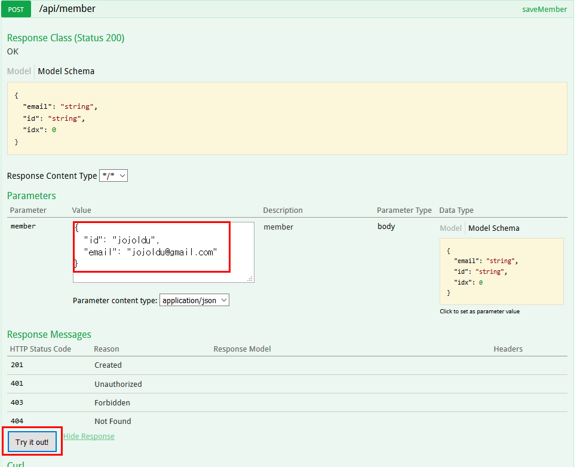
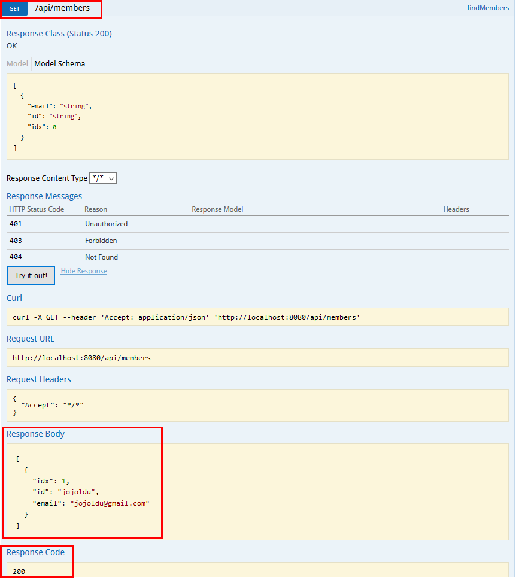

Swagger : 프로젝트에서 지정한 URL들을 HTML화면으로 확인할 수 있게 해주는 프로젝트

https://github.com/jojoldu/blog-code/tree/master/swagger

화면의 메소드들중, POST 기능을 하는 /api/member를 클릭하면 아래와 같은 화면이 나온다. 
여기서 Parameters의 Value에 그 메소드가 받을 수 있는 형태의 데이터를 JSON 형식으로 넣어서, 테스트 할 수 있다.
Swagger에선 해당 메소드가 받을 수 있는 Model Schema도 Parameter 화면에 표기해주고 있으니 보고 Value에 그대로 넣어주면 된다.

위의 사진은 /api/member의 saveMember 메소드를 실행한 결과 (POST 방식)

위의 사진은 /api/member의 findMembers 메소드를 실행한 결과. (GET 방식)
